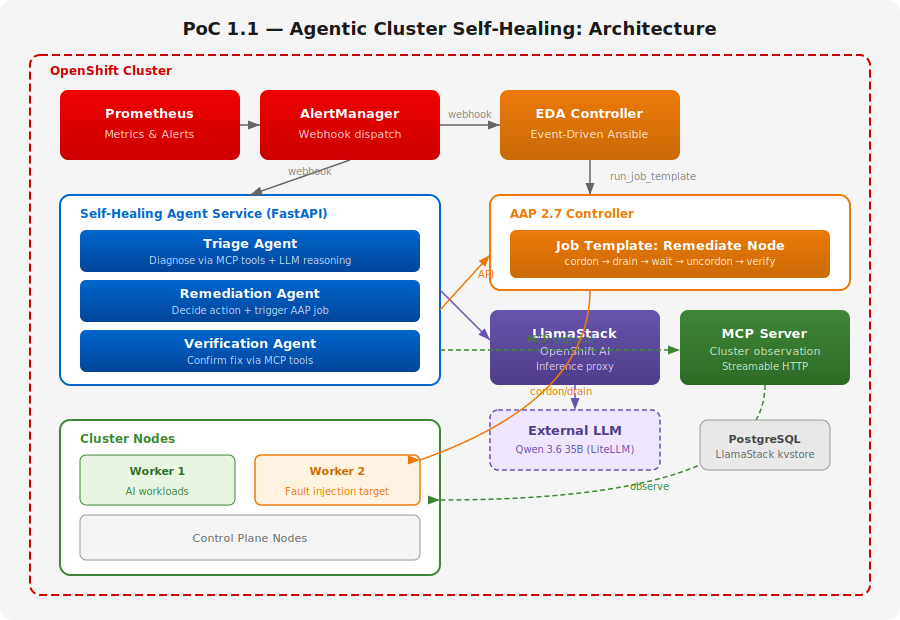
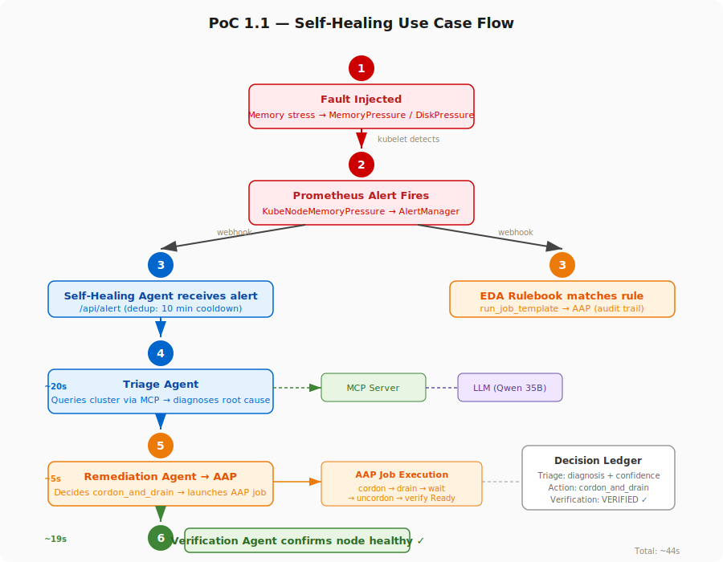

# PoC 1.1: Agentic Cluster Self-Healing

An AI-driven self-healing system for OpenShift that autonomously detects,
diagnoses, and remediates cluster issues.

## Architecture



## Use Case Flow



## Components

| Component | Namespace | Description |
|-----------|-----------|-------------|
| OpenShift AI (RHOAI 3.4) | `redhat-ods-operator` | AI platform operator |
| LlamaStack | `llama-stack` | LLM inference proxy |
| Self-Healing Agent | `llama-stack` | Multi-agent FastAPI service |
| OpenShift MCP Server | `mcp-system` | Cluster observation + write ([shared](../shared/mcp-server/)) |
| AAP 2.7 (Controller + EDA) | `aap` | Remediation execution + event-driven detection |
| PostgreSQL | `llama-stack` | LlamaStack metadata store |

## Prerequisites

- OpenShift 4.19+
- [Shared infrastructure](../shared/) deployed (MCP Server, LlamaStack)
- AAP subscription manifest
- External LLM API (OpenAI-compatible) or local vLLM on GPU

## Deployment

```bash
# 1. Deploy shared infrastructure
oc apply -f ../shared/mcp-server/deployment.yaml
oc apply -f ../shared/mcp-server/rbac.yaml

# 2. Deploy AAP Operator and platform (includes EDA gateway URL fix)
oc apply -f aap/operator.yaml
# Wait for operator...
oc apply -f aap/platform.yaml
# Apply AAP license via UI

# 3. Deploy AAP remediation RBAC
oc apply -f aap/remediation-rbac.yaml

# 4. Deploy RHOAI + LlamaStack (see RHOAI 3.4 docs)

# 5. Build and deploy the agent
oc new-build --binary --name=self-healing-agent --strategy=docker -n llama-stack
oc start-build self-healing-agent --from-dir=agent/ -n llama-stack --follow
oc apply -f agent/deployment.yaml

# 6. Create EDA rulebook activation via API or UI
```

## Configuration

### Environment Variables (Agent)

| Variable | Default | Description |
|----------|---------|-------------|
| `LLAMASTACK_URL` | `http://lsd-granite-milvus-inline-service.llama-stack.svc:8321` | LlamaStack API |
| `MCP_SERVER_URL` | `http://openshift-mcp-server.mcp-system.svc:8001/mcp` | MCP server endpoint |
| `AAP_URL` | `https://aap-aap.apps.<cluster>` | AAP Controller API |
| `AAP_TOKEN` | (from secret) | AAP OAuth token |
| `MODEL_ID` | `vllm-inference/Qwen3.6-35B-A3B` | LLM model ID |
| `COOLDOWN_SECONDS` | `600` | Dedup cooldown per event+node |

## Known Issues

### AAP 2.7: EDA `run_job_template` authentication

The EDA operator defaults `EDA_CONTROLLER_URL` to `http://aap-controller-service` (direct to
controller), but the controller only accepts JWT-authenticated requests routed through the
gateway. The `ansible-rulebook` code already supports gateway routing
([PR #654](https://github.com/ansible/ansible-rulebook/issues/652)) — it auto-detects gateway
URLs and uses the correct API paths.

**Fix**: Set `automation_server_url` in the `AnsibleAutomationPlatform` CR (already included
in [`aap/platform.yaml`](aap/platform.yaml)):

```yaml
spec:
  eda:
    automation_server_url: "http://aap/api/controller"
```

This propagates through: parent AAP CR → EDA CR → configmap → activation pods.

## Testing

```bash
# Manual agent test
oc exec -n llama-stack deploy/self-healing-agent -- \
  curl -s -X POST http://localhost:8000/api/remediate \
  -H 'Content-Type: application/json' \
  -d '{"event_type":"MemoryPressure","node_name":"<node>","severity":"critical"}'

# Fault injection
oc apply -f test/fault-injection.yaml
```

## Playbooks

Ansible playbooks for node remediation are maintained in a separate repository:
https://github.com/cgoncalves/openshift-self-healing-playbooks
