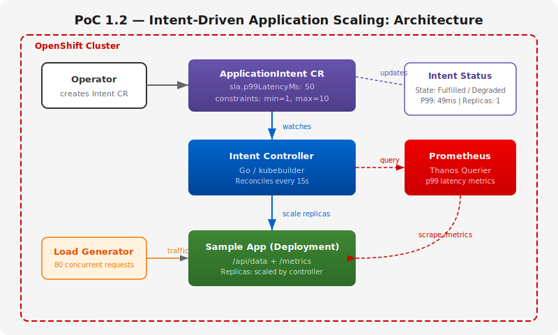
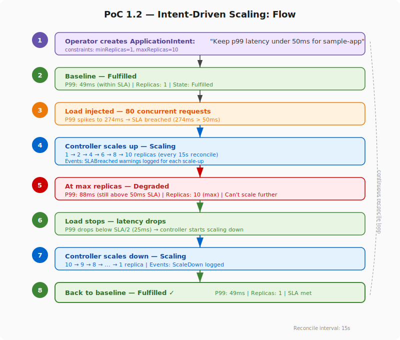

# PoC 1.2: Intent-Driven Application Scaling

A Kubernetes-native intent management system where an operator expresses
a business goal (latency SLA) as a custom resource, and a controller
automatically scales the target deployment to meet it.

## Overview

Instead of manually configuring HPAs, replica counts, and scaling
thresholds, the operator creates a single `ApplicationIntent` CR that
declares *what* they want ("keep p99 latency under 50ms"). The intent
controller handles the *how* — continuously monitoring metrics and
adjusting replicas to fulfill the SLA.

This is the foundational pattern for intent-based management as defined
by TM Forum TMF921 — expressing desired outcomes declaratively and
letting the platform reconcile toward them.

## Architecture



## Scaling Flow



## Demo Scenario

1. **Deploy** a sample web app with 1 replica — baseline p99 latency is
   ~49ms (within the 50ms SLA)
2. **Create intent**: `oc apply -f test/intent-example.yaml` — the
   controller starts monitoring and reports `Fulfilled`
3. **Inject load**: 80 concurrent requests hit the app — p99 spikes to
   274ms, breaching the SLA
4. **Auto-scale**: The controller detects the breach and scales up
   1 → 2 → 4 → 6 → 8 → 10 replicas (every 15s reconcile cycle)
5. **At max replicas**: With 10 replicas and heavy load, p99 stabilizes
   at ~88ms — still above SLA, state shows `Degraded`
6. **Load stops**: p99 drops, controller scales back down
   10 → 9 → ... → 1, state returns to `Fulfilled`
7. **Audit trail**: `oc describe applicationintent` shows every scaling
   event with timestamps and reasons

```
$ oc get applicationintent
NAME               TARGET       STATE       P99MS   REPLICAS   SLA
keep-latency-low   sample-app   Fulfilled   49      1          50

# Under load:
NAME               TARGET       STATE     P99MS   REPLICAS   SLA
keep-latency-low   sample-app   Scaling   274     4          50

# At max replicas:
NAME               TARGET       STATE      P99MS   REPLICAS   SLA
keep-latency-low   sample-app   Degraded   88      10         50
```

## What It Proves

- The **Kubernetes reconciliation loop can express and fulfill
  network-style intents** — the operator thinks in SLAs, not in
  replica counts
- The intent CRD is a **declarative contract**: the operator says
  *what*, the controller decides *how*
- **Status reporting** gives real-time visibility into SLA fulfillment
  without requiring dashboards
- The pattern is **domain-agnostic** — the same controller works for
  any workload that exposes Prometheus metrics
- This is the building block for TMF921-aligned intent management in
  telco autonomous networks

## Components

| Component | Description |
|-----------|-------------|
| Intent Controller | Go/kubebuilder operator, queries Prometheus, scales deployments |
| ApplicationIntent CRD | Custom resource expressing latency SLA + scaling constraints |
| Sample App | Go HTTP server with contention-based latency that increases under load |
| ServiceMonitor | Prometheus scraping config for the sample app metrics |

## Prerequisites

- OpenShift 4.19+ with user workload monitoring enabled
- Prometheus (via OpenShift Monitoring stack)

## Deployment

```bash
# 1. Enable user workload monitoring
oc apply -f - <<EOF
apiVersion: v1
kind: ConfigMap
metadata:
  name: cluster-monitoring-config
  namespace: openshift-monitoring
data:
  config.yaml: |
    enableUserWorkload: true
EOF

# 2. Create namespace
oc new-project poc-1-2

# 3. Build and deploy sample app
oc new-build --binary --name=sample-app --strategy=docker -n poc-1-2
oc start-build sample-app --from-dir=sample-app/ -n poc-1-2 --follow
oc apply -f sample-app/deployment.yaml

# 4. Install CRD
cd controller && make install

# 5. Build and deploy controller
oc new-build --binary --name=intent-controller --strategy=docker -n poc-1-2
oc start-build intent-controller --from-dir=. -n poc-1-2 --follow
# Deploy controller (ServiceAccount, RBAC, Deployment)

# 6. Create intent
oc apply -f test/intent-example.yaml

# 7. Generate load and watch scaling
oc apply -f test/load-generator.yaml
watch oc get applicationintent -n poc-1-2

# Or use the Makefile:
make deploy
make test
```

## Scaling Logic

| Condition | Action | State |
|-----------|--------|-------|
| p99 > SLA | Scale up by 1 (up to maxReplicas) | `Scaling` |
| p99 > SLA, at maxReplicas | No scaling possible | `Degraded` |
| p99 < SLA/2 | Scale down by 1 (down to minReplicas) | `Scaling` |
| SLA/2 ≤ p99 ≤ SLA | No change | `Fulfilled` |
| No metrics (NaN) | Preserve replicas, report no data | `Unknown` |

## Integration with PoC 4.3 (NOC Assistant)

The NOC Assistant can manage ApplicationIntent CRs via natural language:

- "What intents are active?" → queries CRs via MCP
- "What SLA should I set for sample-app?" → analyzes historical Prometheus
  metrics and recommends a target
- "Create an intent for sample-app with p99 under 75ms" → generates the
  CR YAML for the operator to apply

See [poc-4.3/](../poc-4.3/) for details.
