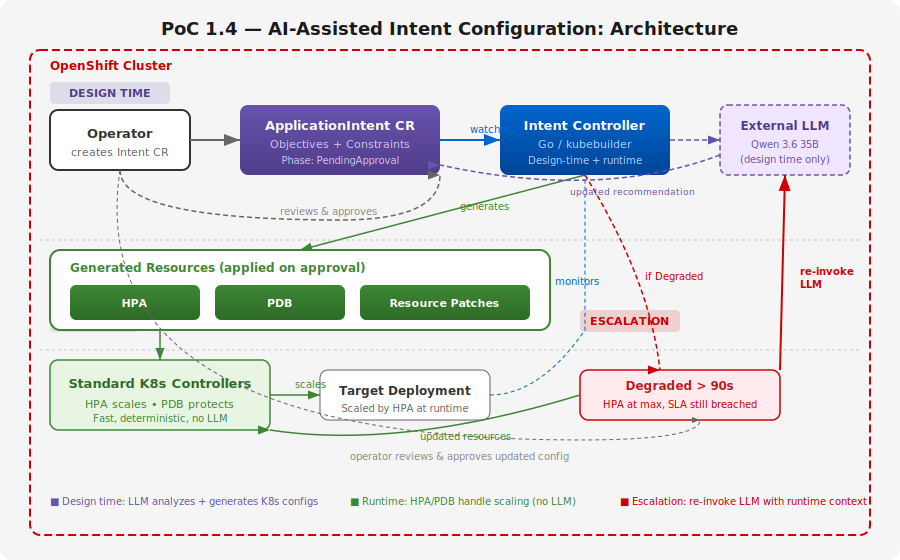
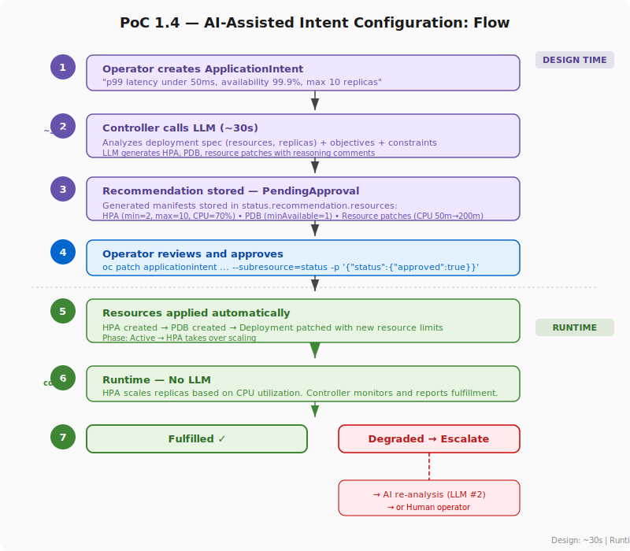
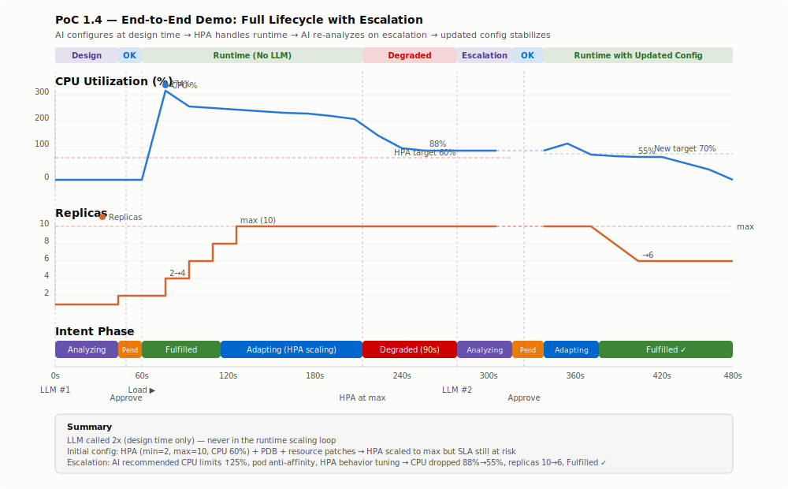

# PoC 1.4: Closed-Loop Intent Management

AI translates business intents into Kubernetes configurations at design
time. Standard controllers handle runtime scaling. When runtime can't
cope, the AI re-analyzes with runtime context and generates an updated
configuration — closing the loop.

## Overview

Instead of an LLM making real-time scaling decisions (too slow, expensive,
and risky for production), the AI acts as a **capacity planner**:

1. **Design time**: Operator creates an intent. The AI analyzes the workload
   and generates HPA, PDB, and resource configurations for human review.
2. **Runtime**: Standard Kubernetes controllers (HPA) handle scaling —
   fast, deterministic, battle-tested. No LLM in the control loop.
3. **Escalation**: When the HPA is at max replicas and the SLA is still
   breached for >90s, the controller re-invokes the LLM with runtime
   context (current CPU, replica count, resource limits). The LLM
   generates an updated recommendation — potentially changing resource
   limits, HPA behavior, pod affinity, or other K8s primitives. The
   operator reviews and approves before the updated config is applied.

## Architecture



## Flow



## Demo Scenario

```bash
# 1. Deploy
make deploy

# 2. Create intent → AI analyzes → PendingApproval
make test
make status

# 3. Review and approve initial recommendation
make approve
make status          # HPA + PDB created, phase: Fulfilled

# 4. Generate heavy load to overwhelm HPA → triggers escalation
make heavy-load      # 200 concurrent, 5 min
# Watch in another terminal:
#   watch 'oc get applicationintent,hpa -n poc-1-4'

# 5. Observe the escalation cycle:
#    Fulfilled → Adapting → Degraded (90s) → Analyzing → PendingApproval

# 6. Approve the escalation recommendation
make approve
make status          # Updated resources applied, phase: Fulfilled

# Teardown
make teardown
```

### What happens at each step

| Step | Phase | What happens | LLM? |
|------|-------|--------------|-------|
| `make test` | Analyzing → PendingApproval | AI generates HPA + PDB + resource patches | Yes |
| `make approve` | Active → Fulfilled | Resources applied, HPA takes over | No |
| `make heavy-load` | Adapting → Degraded | HPA scales to max, SLA still breached | No |
| *(90s later)* | Analyzing → PendingApproval | AI re-analyzes with runtime context, generates updated config | Yes |
| `make approve` | Active → Fulfilled | Updated resources applied, CPU drops, replicas stabilize | No |

## Demo Results



## What It Proves

- AI at **design time** is safer, cheaper, and more predictable than AI
  in a runtime control loop
- The LLM generates **production-quality configs** with reasoning
  (e.g., "Increased CPU from 200m to 400m to allow bursting for p99
  optimization")
- **Human-in-the-loop** approval builds trust — start with manual
  review, graduate to `autoApprove: true` as confidence grows
- Standard K8s controllers (HPA, PDB) are the right tool for runtime —
  the AI's value is in **configuring them correctly**
- The **escalation loop** closes the feedback cycle — when the initial
  config isn't sufficient, the AI re-analyzes with runtime data and
  recommends multi-dimensional changes (resource limits, affinity,
  HPA behavior) that a hardcoded controller can't reason about

## Components

| Component | Description |
|-----------|-------------|
| Intent Controller | Go/kubebuilder, calls LLM at design time + escalation, monitors HPA at runtime |
| ApplicationIntent CRD | Objectives (latency, availability) + constraints + recommendation + fulfillment |
| Sample App | Go HTTP server with contention-based latency (reused from PoC 1.2) |

## Prerequisites

- OpenShift 4.19+
- External LLM API (OpenAI-compatible, e.g., LiteLLM)

## CRD Example

```yaml
apiVersion: an.openshift.io/v1alpha1
kind: ApplicationIntent
metadata:
  name: sample-app-sla
spec:
  target:
    deployment: sample-app
    namespace: poc-1-4
  objectives:
    - type: Latency
      metric: p99
      target: "50ms"
    - type: Availability
      target: "99.9%"
  constraints:
    minReplicas: 2
    maxReplicas: 10
    maxCPUPerPod: "500m"
    maxMemoryPerPod: "256Mi"
  autoApprove: false
```

## Configuration

| Variable | Default | Description |
|----------|---------|-------------|
| `LLAMASTACK_URL` | LiteLLM endpoint | LLM API base URL (OpenAI-compatible) |
| `MODEL_ID` | `Qwen3.6-35B-A3B` | LLM model ID |
| `LLM_API_KEY` | (from env) | API key for the LLM endpoint |
