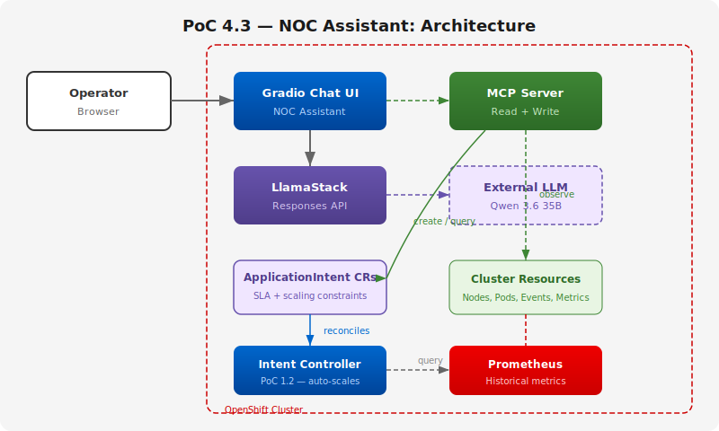
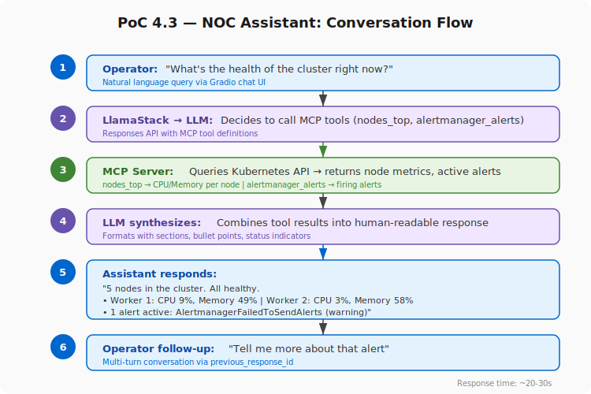

# PoC 4.3: MCP-Integrated NOC Assistant

A natural-language chat interface where NOC operators query cluster health,
investigate issues, manage intents, and execute approved actions — all
through conversation.

## Architecture



## Use Case Flow



## Components

Reuses the existing infrastructure from PoC 1.1 and integrates with
PoC 1.2 (Intent-Driven Scaling):

| Component | Namespace | Description |
|-----------|-----------|-------------|
| NOC Assistant (Gradio) | `llama-stack` | Chat UI for operators |
| LlamaStack | `llama-stack` | LLM inference proxy (Responses API) |
| OpenShift MCP Server | `mcp-system` | Cluster observation + intent management (read/write) |
| External LLM | external | Qwen 3.6 35B via LiteLLM |
| Intent Controller | `poc-1-2` | Fulfills ApplicationIntent CRs (PoC 1.2) |

## Prerequisites

- [Shared infrastructure](../shared/) deployed (MCP Server, LlamaStack)
- PoC 1.2 deployed (ApplicationIntent CRD + controller) for intent management (optional)

## Deployment

```bash
# Build the container image
oc new-build --binary --name=noc-assistant --strategy=docker -n llama-stack
oc start-build noc-assistant --from-dir=app/ -n llama-stack --follow

# Deploy
oc apply -f app/deployment.yaml
```

## Usage

Open the Route URL in a browser:
```
https://noc-assistant-llama-stack.apps.<cluster-domain>
```

### Example Queries

| Query | What the assistant does |
|-------|------------------------|
| "What's the health of the cluster?" | Queries nodes_top, alertmanager_alerts → summarizes |
| "Show me pods in the aap namespace" | Calls pods_list_in_namespace → displays results |
| "Why is pod X crash-looping?" | Queries events_list, pods_log → diagnoses |
| "What alerts are currently firing?" | Queries alertmanager_alerts → lists active alerts |
| "What intents are active?" | Queries ApplicationIntent CRs → shows state, p99, replicas |
| "What SLA should I set for sample-app?" | Queries prometheus_query_range for historical p99 → recommends SLA |
| "Create an intent for sample-app with p99 under 75ms" | Generates correct YAML for the operator to apply* |
| "Relax the SLA to 100ms" | Generates patch YAML for the operator to apply* |

\* The MCP server v0.2 only exposes read tools. Write tools (`resources_create_or_update`)
exist in the [source code](https://github.com/openshift/openshift-mcp-server) but haven't
shipped yet. When a newer image is available, intent creation will work end-to-end without
any changes to the NOC Assistant.

## Configuration

| Variable | Default | Description |
|----------|---------|-------------|
| `LLAMASTACK_URL` | `http://lsd-granite-milvus-inline-service.llama-stack.svc:8321` | LlamaStack API |
| `MCP_SERVER_URL` | `http://openshift-mcp-server.mcp-system.svc:8001/mcp` | MCP server endpoint |
| `MODEL_ID` | `vllm-inference/Qwen3.6-35B-A3B` | LLM model ID |
